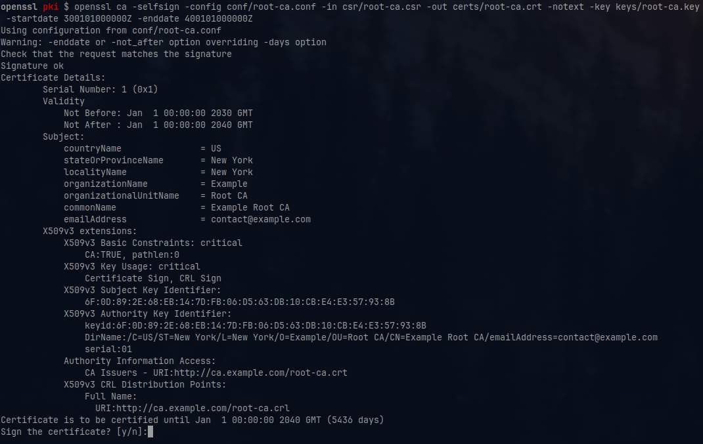

# 🛡️ OpenSSL Public Key Infrastructure (PKI)

This documentation provides a step-by-step guide for setting up a **Public Key Infrastructure** (PKI) using **[OpenSSL](https://docs.openssl.org/)**.



---

- [🛡️ OpenSSL Public Key Infrastructure (PKI)](#️-openssl-public-key-infrastructure-pki)
  - [🗄️ Database Creation](#️-database-creation)
    - [🧹 Cleaning](#-cleaning)
    - [📌 Initialization](#-initialization)
  - [⚙️ Initial Setup](#️-initial-setup)
    - [⚙️ Configuration](#️-configuration)
    - [🔑 Key Generation](#-key-generation)
    - [🏛️ Root Certificate Authority](#️-root-certificate-authority)
    - [🏛️ Subordinate CA](#️-subordinate-ca)
    - [🔗 Generating CA Chain](#-generating-ca-chain)
    - [🔒 Key Protection](#-key-protection)
  - [🚀 Generating](#-generating)
    - [🌐 Server Certificate](#-server-certificate)
    - [👤 Identity Certificate](#-identity-certificate)
    - [🖥️ Code Signing Certificate](#️-code-signing-certificate)
    - [📜 Certificate Revocation List (CRL)](#-certificate-revocation-list-crl)
  - [❌ Revoking a Certificate](#-revoking-a-certificate)
  - [📦 Exporting Certificates](#-exporting-certificates)
    - [🔐 PKCS#12 Format](#-pkcs12-format)
    - [📁 Secure Archive with Encryption](#-secure-archive-with-encryption)
  - [🔍 Useful Commands](#-useful-commands)

---

## 🗄️ Database Creation

### 🧹 Cleaning

```bash
rm -rf ca/root-ca/*
rm -rf ca/sub-ca/*
rm -rf certs/*
rm -rf keys/*
rm -rf crl/*
rm -rf csr/*
```

### 📌 Initialization

```bash
mkdir -p ca/root-ca/db
mkdir -p ca/sub-ca/db

cp /dev/null ca/root-ca/db/root-ca.db
cp /dev/null ca/root-ca/db/root-ca.db.attr
echo 01 > ca/root-ca/db/root-ca.crt.srl
echo 01 > ca/root-ca/db/root-ca.crl.srl

cp /dev/null ca/sub-ca/db/sub-ca.db
cp /dev/null ca/sub-ca/db/sub-ca.db.attr
echo 01 > ca/sub-ca/db/sub-ca.crt.srl
echo 01 > ca/sub-ca/db/sub-ca.crl.srl
```

## ⚙️ Initial Setup

### ⚙️ Configuration

Before proceeding, ensure that the configuration files match your requirements. The following files need to be customized based on your environment:

```text
conf/
├── code.conf
├── identity.conf
├── root-ca.conf
├── server.conf
├── sub-ca.conf
```

Edit these files to define certificate attributes, extensions, and policies that suit your PKI setup.

### 🔑 Key Generation

```bash
umask 077
openssl ecparam -name secp521r1 -genkey -noout -out keys/root-ca.key
openssl ecparam -name secp521r1 -genkey -noout -out keys/sub-ca.key
```

### 🏛️ Root Certificate Authority

```bash
openssl req -new -config conf/root-ca.conf -key keys/root-ca.key -out csr/root-ca.csr
openssl ca -selfsign -config conf/root-ca.conf -in csr/root-ca.csr -out certs/root-ca.crt -notext -key keys/root-ca.key
```

### 🏛️ Subordinate CA

```bash
openssl req -new -config conf/sub-ca.conf -key keys/sub-ca.key -out csr/sub-ca.csr
openssl ca -config conf/root-ca.conf -in csr/sub-ca.csr -out certs/sub-ca.crt -notext
```

### 🔗 Generating CA Chain

```bash
cat certs/sub-ca.crt certs/root-ca.crt > certs/ca-chain.crt
```

### 🔒 Key Protection

```bash
# Encrypt keys
openssl ec -in keys/root-ca.key -aes256 -out keys/root-ca.key.enc
openssl ec -in keys/sub-ca.key -aes256 -out keys/sub-ca.key.enc

# Decrypt keys
openssl ec -in keys/root-ca.key.enc -aes256 -out keys/root-ca.key
openssl ec -in keys/sub-ca.key.enc -aes256 -out keys/sub-ca.key

# Securely remove keys after usage
shred -zvn 100 -in keys/root-ca.key
shred -zvn 100 -in keys/sub-ca.key
```

> ⚠️ **Warning**: Server, identity, and code signing keys are not encrypted by default. Ensure they are protected and deleted securely after export.

## 🚀 Generating

### 🌐 Server Certificate

```bash
export SAN="DNS:www.example.com, DNS:example.com"
openssl ecparam -name secp384r1 -genkey -noout -out keys/www.example.com.key
openssl req -new -config conf/server.conf -key keys/www.example.com.key -out csr/www.example.com.csr
openssl ca -config conf/sub-ca.conf -in csr/www.example.com.csr -out certs/www.example.com.crt -notext -extensions server_ext
```

### 👤 Identity Certificate

```bash
openssl ecparam -name secp384r1 -genkey -noout -out keys/user.key
openssl req -new -config conf/identity.conf -key keys/user.key -out csr/user.csr
openssl ca -config conf/sub-ca.conf -in csr/user.csr -out certs/user.crt -notext -extensions identity_ext
```

### 🖥️ Code Signing Certificate

```bash
openssl ecparam -name secp384r1 -genkey -noout -out keys/code.key
openssl req -new -config conf/code.conf -key keys/code.key -out csr/code.csr
openssl ca -config conf/sub-ca.conf -in csr/code.csr -out certs/code.crt -notext -extensions code_signing_ext
```

### 📜 Certificate Revocation List (CRL)

```bash
openssl ca -gencrl -config conf/root-ca.conf -out crl/root-ca.crl
openssl ca -gencrl -config conf/sub-ca.conf -out crl/sub-ca.crl
```

## ❌ Revoking a Certificate

```bash
openssl ca -config conf/sub-ca.conf -revoke certs/code.crt -crl_reason superseded
openssl ca -gencrl -config conf/sub-ca.conf -out crl/sub-ca.crl
```

**🔍 Possible Revocation Reasons ([RFC 5280](https://datatracker.ietf.org/doc/html/rfc5280))**

- `unspecified`
- `keyCompromise`
- `CACompromise`
- `affiliationChanged`
- `superseded`
- `cessationOfOperation`
- `certificateHold`
- `removeFromCRL`
- `privilegeWithdrawn`
- `AACompromise`

## 📦 Exporting Certificates

### 🔐 PKCS#12 Format

```bash
openssl pkcs12 -export -inkey keys/www.example.com.key -in certs/www.example.com.crt -certfile certs/ca-chain.crt -name "www.example.com" -out www.example.com.p12

# Extract contents from PKCS#12
openssl pkcs12 -in www.example.com.p12 -nocerts -nodes -out www.example.com.key
openssl pkcs12 -in www.example.com.p12 -clcerts -nokeys -out www.example.com.crt
openssl pkcs12 -in www.example.com.p12 -cacerts -nokeys -out ca-chain.crt
```

### 📁 Secure Archive with Encryption

```bash
tar -czf www.example.com.tar.gz --transform='s|.*/||' certs/www.example.com.crt keys/www.example.com.key certs/ca-chain.crt
openssl enc -aes-256-cbc -salt -pbkdf2 -iter 100000 -in www.example.com.tar.gz -out www.example.com.tar.gz.enc

# Decrypt and extract
openssl enc -d -aes-256-cbc -pbkdf2 -iter 100000 -in www.example.com.tar.gz.enc -out www.example.com.tar.gz
tar -xzf www.example.com.tar.gz
```

## 🔍 Useful Commands

```bash
# Print CSR details
openssl req -text -noout -in csr/root-ca.csr

# Print certificate details
openssl x509 -text -noout -in certs/www.example.com.crt

# Print CRL details
openssl crl -text -noout -in crl/root-ca.crl
```

🎯 Ensure you follow security best practices and protect sensitive keys appropriately!
